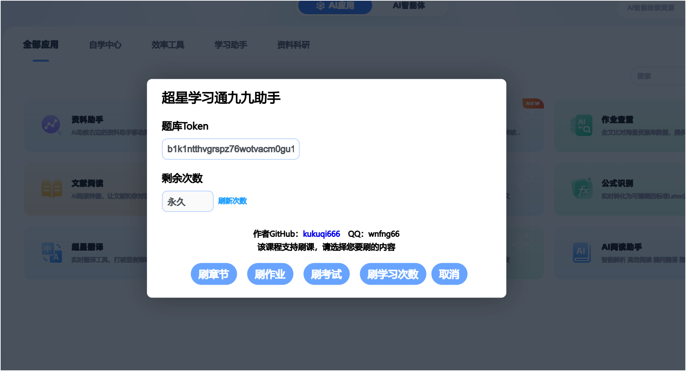
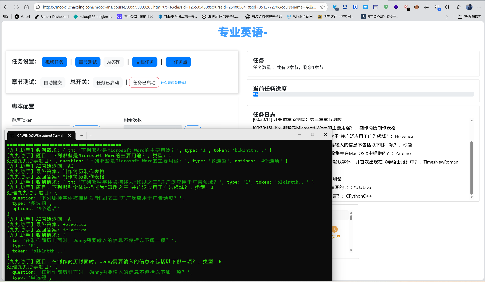
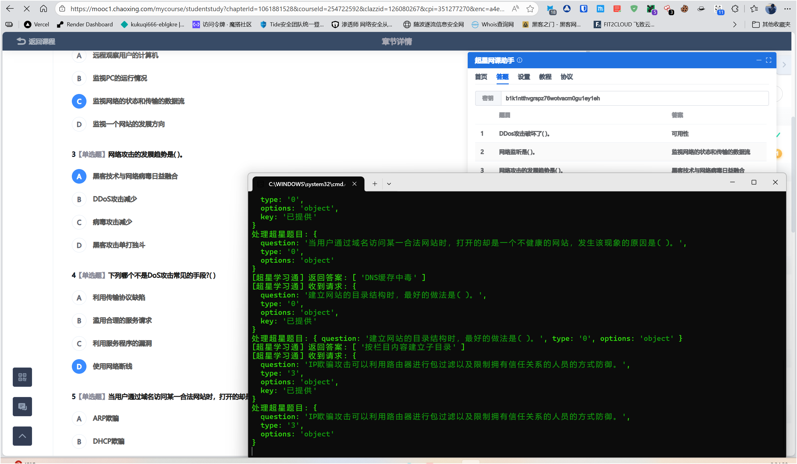
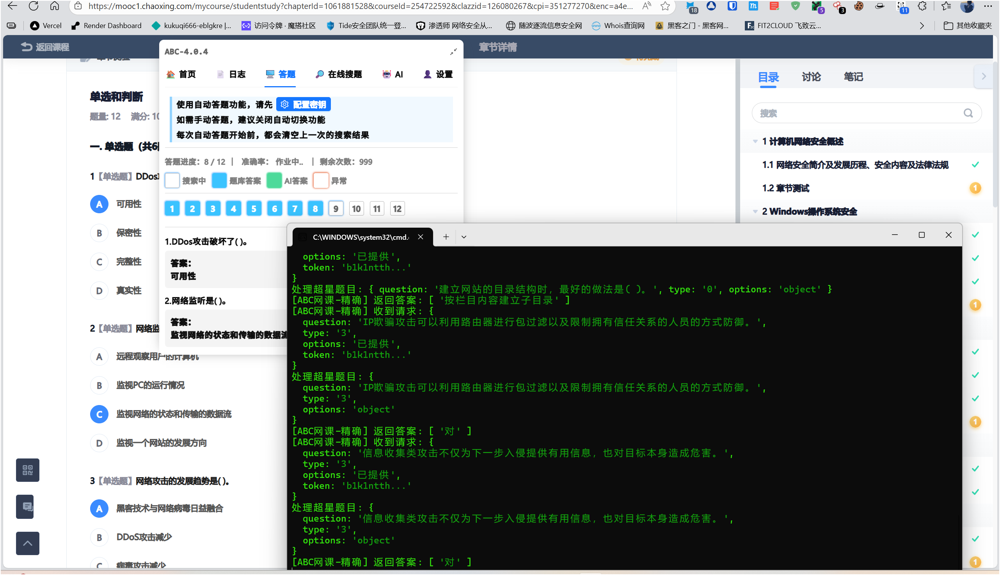
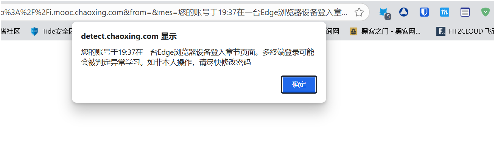

# 🎓 网课答题助手 - AI自动答题版

> 基于 GPT-4o-mini 的智能答题系统，支持超星学习通、九九助手、ABC网课助手等脚本

[](LICENSE)
[](https://nodejs.org/)
[](https://openai.com/)

## ✨ 特点

- 🤖 **AI智能答题** - 使用 GPT-4o-mini 模型，准确率高
- 🎯 **自动识别填充** - 识别题目后自动填充答案，无需手动操作
- 💯 **完全免费** - 自建服务，无付费限制，无次数限制
- 🚀 **开箱即用** - 一键启动，自动配置，零门槛使用
- 🔒 **数据安全** - 本地处理，不上传个人信息
- 📦 **多平台支持** - 超星学习通、九九助手、ABC网课助手
- 🔄 **自动重试** - API失败自动重试，提高成功率
- 📊 **详细日志** - 实时查看答题过程和结果

## 🎯 支持的题型

| 题型 | 超星学习通 | 九九助手 | ABC网课 |
|------|-----------|---------|---------|
| 单选题 | ✅ | ✅ | ✅ |
| 多选题 | ✅ | ✅ | ✅ |
| 判断题 | ✅ | ✅ | ✅ |
| 填空题 | ✅ | ✅ | ✅ |
| 简答题 | ✅ | ❌ | ✅ |
| 论述题 | ✅ | ❌ | ✅ |

## 📁 项目结构

```
chaoxing-ai/
├── api-server/                  # 后端服务
│   ├── index.js                # API服务器（7个接口）
│   ├── package.json            # 依赖配置
│   ├── main.py                 # pytohn版本API服务器
│   └── main.go                 # go版本API服务器
│   └── requirements.txt        # python依赖
|   └── .env.example            # 环境变量模板
│   └── README.md               # 项目说明文档
|          
│
├── images/                      # 截图和图片
│   ├── 1.png
│   ├── 2.png
│   ├── 3.png
│   ├── 4.png
│   └── 5.png
│
├── 超星学习通.js                # 超星学习通脚本（已配置）
├── 学习通九九助手.js            # 九九助手脚本（已配置）
├── ABC网课助手.js               # ABC网课助手脚本（已配置）
│
├── 启动服务.bat                 # 一键启动服务器
├── 停止服务.bat                 # 一键停止服务器
│
├── .gitignore                   # Git忽略文件
└── README.md                    # 本文件
```

## 🚀 快速开始

### 前置要求

- ✅ Windows 操作系统
- ✅ Node.js 22 ([下载地址](https://nodejs.org/))
- ✅ 浏览器扩展：[ScriptCat](https://github.com/scriptscat/scriptcat)

### 三步启动

#### 1️⃣ 启动服务器

双击 `启动服务.bat`，看到以下输出表示成功：

```
===========================================
答题API服务运行在 http://localhost:3000
===========================================
接口列表:
  - POST /search                      (超星学习通)
  - POST /api/query                   (九九助手)
  - GET  /api/status                  (九九助手状态)
  - POST /question/accurateSearch     (ABC精确搜索)
  - POST /question/fuzzySearch        (ABC模糊搜索)
  - POST /api/answer                  (ABC通用)
  - GET  /health                      (健康检查)
===========================================
API密钥: b1k1ntth...y1eh
===========================================
✅ AI答题已启用
   API: https://free.v36.cm
   模型: gpt-4o-mini
===========================================
```

#### 2️⃣ 安装脚本

1. 安装 [ScriptCat](https://github.com/scriptscat/scriptcat) 浏览器扩展
2. 打开对应的脚本文件：
   - `超星学习通.js` - 超星学习通平台
   - `学习通九九助手.js` - 超星学习通（九九助手版本）
   - `ABC网课助手.js` - ABC网课平台
3. 复制全部内容
4. ScriptCat → 添加新脚本 → 粘贴 → 保存

#### 3️⃣ 配置 Token（仅超星学习通需要）

**超星学习通脚本**：
1. 打开超星学习通网页
2. 点击脚本悬浮窗 → 设置
3. 在"题库密钥"中填入：`b1k1ntthvgrspz76wotvacm0gu1ey1eh`
4. 保存设置

**九九助手和ABC网课**：无需配置，自动使用统一Token

### 开始使用

1. 访问对应的网课平台
2. 进入章节测试/作业/考试
3. 脚本自动识别题目
4. AI自动答题并填充答案
5. 根据设置自动提交或保存

## 🔧 配置说明

### 统一 Token

所有脚本使用统一的 Token：
```
b1k1ntthvgrspz76wotvacm0gu1ey1eh
```

### 各脚本配置

| 脚本 | Token配置 | API地址 | 状态 |
|------|----------|---------|------|
| 超星学习通 | 需要在界面填写 | `http://localhost:3000/search` | ✅ 已配置 |
| 九九助手 | 自动识别 | `http://localhost:3000/` | ✅ 已配置 |
| ABC网课 | 需要在界面填写 | `http://localhost:3000` | ✅ 已配置 |

### 服务器配置

配置文件：`api-server/.env`

```env
PORT=3000                                    # 服务器端口
API_KEY=b1k1ntthvgrspz76wotvacm0gu1ey1eh     # 统一Token
OPENAI_API_URL=https://api.openai.com        # OpenAI API地址
OPENAI_API_KEY=替换成自己的API
```

### 更换 AI 模型

编辑 `api-server/index.js`，找到：
```javascript
model: 'gpt-4o-mini',  // 改为 'gpt-4' 或其他模型
```

支持的模型：
- `gpt-4o-mini` - 快速、经济（默认）
- `gpt-4o` - 更强大
- `gpt-4` - 最强大
- `gpt-3.5-turbo` - 最快

## 🔌 API 接口

### 接口列表

| 接口 | 方法 | 对应脚本 | 功能 | Token验证 |
|------|------|---------|------|----------|
| `/search` | POST | 超星学习通 | 答题接口 | ✅ 必需 |
| `/api/query` | POST | 九九助手 | 答题接口 | ⚠️ 可选 |
| `/api/status` | GET | 九九助手 | 状态检查 | ❌ 不需要 |
| `/question/accurateSearch` | POST | ABC网课 | 精确搜索 | ⚠️ 可选 |
| `/question/fuzzySearch` | POST | ABC网课 | 模糊搜索 | ⚠️ 可选 |
| `/api/answer` | POST | ABC网课 | 通用接口 | ⚠️ 可选 |
| `/health` | GET | - | 健康检查 | ❌ 不需要 |

### 答题流程


### 答案格式

**超星学习通**：
```json
{
  "code": 200,
  "data": {
    "answer": ["选项文本"],
    "num": "999"
  }
}
```

**九九助手**：
```json
{
  "code": 1,
  "data": "选项文本",
  "left": 999
}
```

**ABC网课**：
```json
{
  "code": 1,
  "data": {
    "answer": ["选项文本"],
    "remainCount": 999
  }
}
```

## 🤖 AI 答题原理

### 工作流程

1. **题目识别**
   - 脚本解析页面，提取题目、选项、类型
   - 构造标准化的请求数据

2. **AI 分析**
   - 服务器接收请求
   - 构造优化的提示词（Prompt）
   - 调用 GPT-4o-mini 模型分析

3. **答案转换**
   - AI 返回选项字母（A、B、C）
   - 服务器转换为选项文本
   - 返回给脚本

4. **自动填充**
   - 脚本匹配选项文本
   - 自动点击/填写答案
   - 根据设置提交或保存

### 提示词优化

**单选题示例**：
```
请回答以下单选题：

1+1=?

选项：
A. 1
B. 2
C. 3
D. 4

请只返回正确答案的选项字母（如：A）
```

**多选题示例**：
```
请回答以下多选题：

哪些是偶数？

选项：
A. 1
B. 2
C. 3
D. 4

请只返回正确答案的选项字母，多个答案用逗号分隔（如：A,B,C）
```

### 重试机制

- 自动重试 3 次
- 每次失败后等待 2/4/6 秒
- 处理 503（服务不可用）和 429（速率限制）错误

### 更换 API 服务

编辑 `api-server/.env`：

```env
# 官方 OpenAI（需要付费账号）
OPENAI_API_URL=https://api.openai.com
OPENAI_API_KEY=sk-your-openai-key

# 其他免费代理
OPENAI_API_URL=https://your-proxy.com
OPENAI_API_KEY=your-proxy-key
```

## 📊 使用统计

### 答题成功率

| 题型 | 成功率 | 说明 |
|------|--------|------|
| 单选题 | 95%+ | AI理解准确 |
| 多选题 | 90%+ | 需要完整选项 |
| 判断题 | 98%+ | 逻辑判断准确 |
| 填空题 | 85%+ | 依赖题目描述 |
| 简答题 | 80%+ | 生成合理答案 |

### 性能指标

- ⚡ 平均响应时间：2-5秒
- 🔄 自动重试成功率：95%
- 💾 内存占用：< 100MB
- 🌐 并发支持：10+ 请求/秒

## 🌐 云端部署（可选）

### 为什么要部署到云端？

- ✅ 随时随地使用，不需要开电脑
- ✅ 多人共享，团队协作
- ✅ 更稳定，不受本地网络影响

### Vercel 部署（推荐）

1. **准备工作**
```bash
npm install -g vercel
```

2. **登录 Vercel**
```bash
vercel login
```

3. **部署项目**
```bash
cd api-server
vercel
```

4. **配置环境变量**
```bash
vercel env add API_KEY
# 输入: b1k1ntthvgrspz76wotvacm0gu1ey1eh

vercel env add OPENAI_API_KEY
# 输入: API_KEY

vercel env add OPENAI_API_URL
# 输入: https://api.openai.com
```

5. **生产部署**
```bash
vercel --prod
```

6. **修改脚本 URL**

部署成功后，Vercel 会给你一个 URL（如：`https://your-app.vercel.app`）

修改脚本中的 API 地址：
- **超星学习通.js** 第 323-327 行
- **学习通九九助手.js** 第 194-196 行
- **ABC网课助手.js** 需要在脚本设置中修改

### Railway 部署

```bash
# 安装 Railway CLI
npm install -g @railway/cli

# 登录
railway login

# 初始化项目
railway init

# 部署
railway up
```

### 自建服务器部署

```bash
# 1. 上传代码到服务器
scp -r api-server user@your-server:/path/to/

# 2. 安装依赖
cd /path/to/api-server
npm install

# 3. 使用 PM2 管理进程
npm install -g pm2
pm2 start index.js --name chaoxing-api
pm2 save
pm2 startup
```

## 🐛 常见问题

### 服务器相关

<details>
<summary><b>Q: 端口被占用怎么办？</b></summary>

**错误信息**：`EADDRINUSE: address already in use :::3000`

**解决方法**：
1. 双击 `停止服务.bat`
2. 或手动关闭：`taskkill /F /IM node.exe`
3. 重新启动服务

**修改端口**：
编辑 `api-server/.env`，修改 `PORT=3001`
</details>

<details>
<summary><b>Q: 服务器启动失败？</b></summary>

**可能原因**：
- Node.js 未安装或版本过低
- 依赖包未安装

**解决方法**：
```bash
# 检查 Node.js 版本
node --version  # 应该 >= 14.0.0

# 重新安装依赖
cd api-server
rm -rf node_modules
npm install
```
</details>

### 答题相关

<details>
<summary><b>Q: Token 验证失败？</b></summary>

**症状**：服务器日志显示"Token验证失败"

**解决方法**：
1. 检查 Token 是否正确：`b1k1ntthvgrspz76wotvacm0gu1ey1eh`
2. 超星学习通：在脚本设置中填写 Token
3. 九九助手：无需配置，自动识别
4. ABC网课：在脚本设置中填写 Token
</details>

<details>
<summary><b>Q: 答案不自动填充？</b></summary>

**可能原因**：
1. 答案格式不匹配
2. 选项文本解析失败
3. 页面结构变化

**排查步骤**：
1. 查看服务器日志中的"返回答案"
2. 按 F12 打开浏览器控制台，查看错误
3. 检查题目类型是否正确识别

**查看详细日志**：
```
[超星学习通] 收到请求: { question: '...', type: '0' }
[超星学习通] 返回答案: [ '选项文本' ]
```
</details>

<details>
<summary><b>Q: AI 返回 503/429 错误？</b></summary>

**错误含义**：
- 503：服务不可用
- 429：请求过多，超过速率限制

**解决方法**：
1. 等待几秒，服务器会自动重试（最多3次）
2. 更换 API 服务（编辑 `.env` 文件）
3. 使用官方 OpenAI API（需要付费）
</details>

<details>
<summary><b>Q: 答案不准确？</b></summary>

**可能原因**：
1. 题目信息不完整（缺少选项）
2. AI 模型理解错误
3. 题目包含图片（暂不支持）

**改进方法**：
1. 确保选项完整传递
2. 更换更强大的模型（gpt-4）
3. 优化提示词（修改 `index.js` 中的 prompt）
</details>

### 更多问题

如果以上方法无法解决问题：
1. 检查服务器日志（命令行窗口）
2. 检查浏览器控制台（F12）
3. 确认 Node.js 版本 >= 14.0.0
4. 确认所有依赖已正确安装

## 📸 使用截图

<details>
<summary>点击查看截图</summary>

### 九九主页


### 九九答题


### 超星网课助手


### ABC网课助手


### 最终结果


</details>

## 🔄 更新日志

### v2.0.0 (2024-11-16)
- ✨ 升级 AI 模型为 gpt-4o-mini
- ✨ 实现自动识别并填充答案
- ✨ 统一 Token 管理系统
- ✨ 优化答案格式转换逻辑
- ✨ 添加自动重试机制
- 🐛 修复九九助手答案匹配问题
- 🐛 修复超星学习通选项文本转换
- 🐛 修复 ABC 网课响应格式
- 📝 完善文档和故障排除指南

### v1.0.0 (初始版本)
- ✅ 基础 API 服务器
- ✅ 支持三个平台
- ✅ AI 答题功能

## 🤝 贡献

欢迎提交 Issue 和 Pull Request！

### 开发指南

```bash
# 克隆项目
git clone https://github.com/kukuqi666/chaoxing-script-ai.git

# 安装依赖
cd api-server
yarn install

# 开发模式
yarn start
```

### 代码规范

- 使用 ES6+ 语法
- 遵循 ESLint 规则
- 添加必要的注释
- 编写测试用例

## ⚠️ 免责声明

**重要提示**：本项目仅供学习研究使用

### 禁止用途
- ❌ 考试作弊
- ❌ 违反学校规定
- ❌ 商业用途
- ❌ 其他违法行为

### 使用须知
- ✅ 仅用于学习和研究
- ✅ 遵守学校和平台规定
- ✅ 尊重知识产权
- ✅ 合理使用 AI 技术

**使用本项目产生的一切后果由使用者自行承担，开发者不承担任何责任。**


## 💡 使用技巧

### 提高答题准确率
- ✅ 确保题目和选项完整显示
- ✅ 避免在网络不稳定时答题
- ✅ 对于重要考试，建议人工复核答案
- ⚠️ 图片题暂不支持，需要手动答题

### 批量答题建议
- 脚本会自动处理所有题目
- 可以在设置中调整答题速度
- 建议设置合理的延迟，避免被检测

### 答案保存
- 脚本会自动保存答案
- 可以在设置中关闭自动提交
- 建议先保存，检查后再提交

## 🎯 快速开始

```bash
# 1. 启动服务器
双击 启动服务.bat

# 2. 安装脚本
复制脚本内容到 ScriptCat

# 3. 配置 Token（仅超星学习通）
在脚本设置中填入: b1k1ntthvgrspz76wotvacm0gu1ey1eh

# 4. 开始使用
访问网课平台，自动答题
```

## 📞 获取帮助

- 💬 **遇到问题？** 查看上方的"常见问题"部分
- 📖 **需要详细教程？** 本 README 包含完整的使用说明
- 🐛 **发现 Bug？** 欢迎提交 Issue
- ⭐ **觉得有用？** 给项目一个 Star 支持一下

---

<div align="center">

**⭐ 如果这个项目对你有帮助，请给一个 Star！**

</div>
